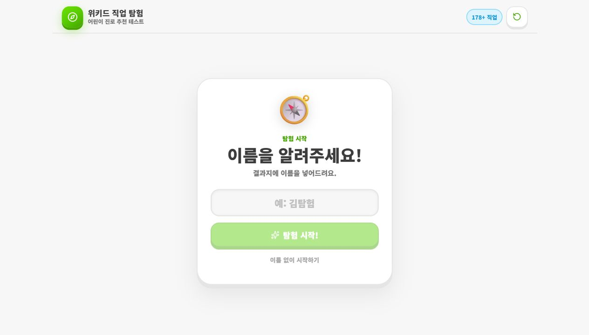
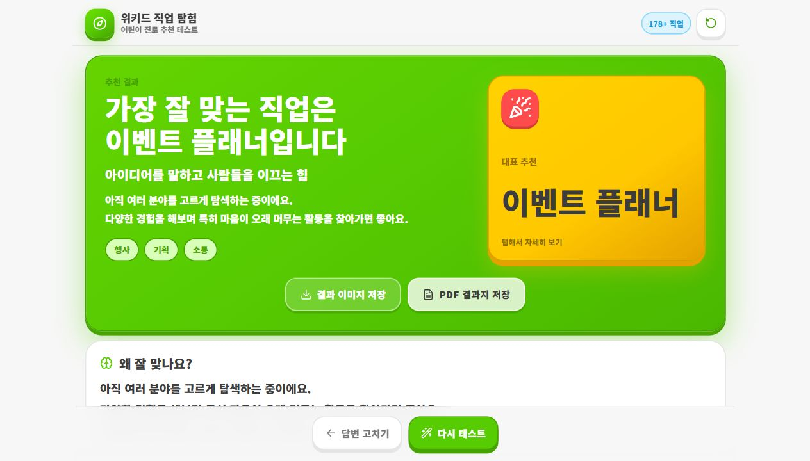
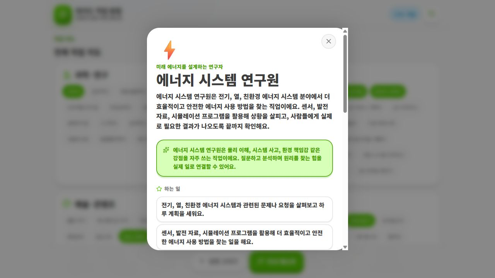
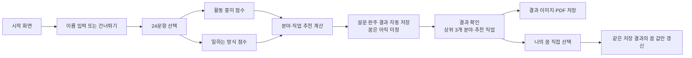

<div align="center">


# 위키드 직업 탐험

초등학생이 24개의 쉬운 선택형 문항을 풀고,
자신의 흥미와 일하는 방식에 맞는 **여러 진로 분야와 직업**을 탐험하는 모바일 중심 웹사이트입니다.

**질문은 쉽고, 결과는 넓게.**
한 직업으로 진로를 단정하지 않고, 세 가지 진로 분야와 여러 직업을 함께 제안합니다. 아이는 추천 직업, 전체 목록, 직접 입력, 더 탐색하기 중에서 자신의 꿈을 직접 선택할 수 있습니다.

</div>

---

## 최근 업데이트: 초등학생 진로 탐험 v2

- 30문항·대표 직업 1개 방식에서, 승인된 24개 생활·놀이 상황 문항과 다분야 결과 방식으로 바뀌었습니다.
- 아이돌, 모델, 유튜버, 크리에이터, CEO, 수학자, 정보보안 전문가, 음악가를 포함한 초등학생 친화적 107개 직업을 14개 분야로 정리했습니다.
- `아직 잘 모르겠어요` 응답은 추천 점수에 넣지 않아, 모르는 답 때문에 특정 직업으로 치우치지 않도록 했습니다.
- 결과는 상위 3개 분야와 분야별 여러 직업을 보여 주며, 동점은 이름순으로 억지로 가르지 않습니다.
- Firestore에는 문항별 응답, 분야별 점수, 추천 결과, 아이가 최종 선택한 꿈을 저장합니다. owner 관리자는 응답 상세와 CSV를 확인할 수 있습니다.
- 명함 제작 화면에서 owner 관리자는 이름으로 설문 응답을 찾아 불러오고 107개 직업 중 하나를 선택할 수 있습니다.

검증 명령:

```bash
npm test
npm run check:data
npm run check:distribution
npm run check:business-card
npm run build
```

`npm run build`는 진로 데이터 검사, 10만 가지 결정론적 응답 분포 검사, 명함 기능 검사, TypeScript 컴파일, Vite 빌드를 순서대로 실행합니다.

---

## 화면 미리보기

README의 화면 이미지는 `docs/readme/` 폴더에서 관리합니다. 화면 구성을 크게 변경한 경우, 아래 파일을 새 화면으로 다시 캡처해 갱신해 주세요.

<table>
  <tr>
    <td align="center" width="33%">
      
      <br />
      <strong>시작 화면</strong>
      <br />
      <sub>이름 입력 또는 이름 없이 시작</sub>
    </td>
    <td align="center" width="33%">
      
      <br />
      <strong>결과 화면</strong>
      <br />
      <sub>진로 분야와 여러 추천 직업</sub>
    </td>
    <td align="center" width="33%">
      
      <br />
      <strong>직업 상세 보기</strong>
      <br />
      <sub>하는 일, 일하는 곳, 필요한 능력</sub>
    </td>
  </tr>
</table>

<p align="center">
  
  
  
  
</p>

---

## 프로젝트 한눈에 보기

| 구분 | 내용 |
| --- | --- |
| 서비스 이름 | 위키드 직업 탐험 |
| 목적 | 어린이가 자신의 흥미와 강점을 바탕으로 다양한 진로 분야와 직업을 탐색하도록 돕는 웹 테스트 |
| 주요 사용자 | 초등학생, 청소년센터/복지센터/교육기관 실무자 |
| 문항 수 | 총 24문항: 활동 흥미 16개 + 일하는 방식 8개 |
| 직업 데이터 | 초등학생 친화적 직업 107개, 직업 지도 14개 분야 |
| 결과 방식 | 상위 3개 진로 분야 + 분야별 여러 직업 + 최종 꿈 선택 |
| owner 관리자 기능 | 응답별 문항 선택, 분야 점수, 추천 결과, 최종 꿈, CSV 조회 |
| 디자인 방향 | 듀오링고에서 영감을 받은 초록/노랑 중심, 둥글고 말랑한 모바일 우선 UI |
| 기술 스택 | React, TypeScript, Vite, Firebase, CSS, lucide-react, html2canvas, jsPDF |

---

## 서비스 흐름



결과 이미지와 PDF는 꿈을 선택하기 전에도 저장할 수 있습니다. 꿈을 선택하면 이미 자동 저장된 같은 결과에서 `dreamChoice` 값만 갱신됩니다.

---

## 왜 만든 프로젝트인가요?

기존의 진로 검사는 아이들에게 어렵거나 딱딱하게 느껴질 수 있습니다.
이 프로젝트는 아이들이 태블릿이나 휴대폰에서 직접 선택하면서 자연스럽게 자신의 관심을 발견하도록 만드는 데 초점을 두었습니다.

검사는 성격 유형 이름을 붙이거나 직업 하나를 정답처럼 말하는 방식이 아닙니다.
결과 화면에는 이론 용어나 유형 코드가 나오지 않고, 아이가 바로 이해할 수 있는 활동과 직업 중심 문장으로 보여 줍니다.

예를 들면 다음과 같은 방식입니다.

| 단정적인 결과 | 위키드 직업 탐험의 결과 |
| --- | --- |
| `너는 과학자야` | 호기심 많은 탐구자 분야가 잘 맞을 수 있어요. 과학자, 천문학자, 수학자를 살펴보세요. |
| `너는 선생님이야` | 따뜻한 성장 조력자 분야에서 선생님, 사서, 심리상담사 같은 일을 탐험해 보세요. |
| `너는 소방관이야` | 활력 넘치는 행동가와 정의로운 세상 수호자 분야를 함께 살펴보세요. |

---

## 핵심 기능

<table>
  <tr>
    <td width="50%">
      <strong>말랑한 모바일 테스트</strong>
      <br />
      <sub>휴대폰에서 바로 누르기 좋은 큰 버튼, 둥근 카드, 선명한 진행 표시를 사용합니다.</sub>
    </td>
    <td width="50%">
      <strong>분야 중심 결과</strong>
      <br />
      <sub>직업 하나로 정하지 않고, 아이에게 친숙한 진로 분야와 여러 직업을 함께 보여 줍니다.</sub>
    </td>
  </tr>
  <tr>
    <td width="50%">
      <strong>107개 직업 탐험</strong>
      <br />
      <sub>아이돌, 유튜버, 과학자, 수의사처럼 아이가 자주 꿈꾸는 직업을 분야별로 찾아볼 수 있습니다.</sub>
    </td>
    <td width="50%">
      <strong>저장 가능한 결과지</strong>
      <br />
      <sub>결과 이미지를 저장하거나 상담 현장에서 쓰기 좋은 PDF 결과지로 출력할 수 있습니다.</sub>
    </td>
  </tr>
</table>

### 1. 이름 입력 또는 이름 없이 시작

처음 화면에서 이름을 입력하면 결과지와 PDF 파일명에 이름이 들어갑니다.
이름을 입력하지 않아도 테스트는 바로 시작할 수 있습니다.

### 2. 24문항 선택형 진로 테스트

아이들이 바로 고를 수 있도록 모든 문항은 학교생활, 만들기, 친구 돕기, 발표, 정리 같은 일상 상황으로 작성되어 있습니다. 두 선택지가 모두 좋거나 모두 별로여도 **조금 더 해 보고 싶은 쪽**을 고르면 됩니다.

구성은 다음과 같습니다.

| 문항 종류 | 문항 수 | 역할 |
| --- | ---: | --- |
| 활동 흥미 문항 | 16개 | 어떤 활동에 마음이 가는지 파악 |
| 일하는 방식 문항 | 8개 | 함께하기·집중하기·계획하기처럼 편한 방식을 보조 판단 |
| `아직 잘 모르겠어요` | 모든 문항 | 응답 점수에서 제외하고 탐색 기회로 남김 |

### 3. 세 가지 진로 분야 결과

테스트가 끝나면 점수가 높은 세 분야를 차례로 보여 줍니다. 분야의 이름은 아이가 이해하기 쉬운 문장으로 표시합니다.

```text
호기심 많은 탐구자 — 과학·연구
영리한 미래 설계자 — 기술·디지털
상상력 넘치는 창작자 — 예술·콘텐츠
```

모든 문항에 `아직 잘 모르겠어요`를 선택했다면, 특정 분야를 억지로 추천하지 않고 여러 활동을 경험해 보도록 안내합니다.

### 4. 여러 추천 직업과 최종 꿈 선택

각 결과 분야에는 여러 직업을 함께 제안합니다. 아이는 다음 방법 중 하나로 자신의 꿈을 고를 수 있습니다.

| 방법 | 설명 |
| --- | --- |
| 추천 직업 선택 | 결과에서 제안된 직업을 선택 |
| 전체 목록 탐색 | 14개 직업 지도 분야의 107개 직업에서 선택 |
| 직접 입력 | 아직 목록에 없는 꿈을 직접 적어 선택 |
| 더 탐색하기 | `아직 더 찾아볼래요`를 선택해 결과를 확정하지 않음 |

### 5. 107개 직업 상세 보기

전체 직업 지도에 있는 모든 직업은 탭해서 자세히 볼 수 있습니다.
상세 화면에는 다음 정보가 들어갑니다.

| 항목 | 설명 |
| --- | --- |
| 직업 소개 | 이 직업이 어떤 일을 하는지 한눈에 설명 |
| 하는 일 | 실제 업무를 아이 눈높이로 정리 |
| 일하는 곳 | 주로 활동하는 장소 |
| 필요한 능력 | 직업에 자주 쓰이는 강점 |
| 학교에서 해볼 것 | 지금 바로 해볼 수 있는 작은 활동 |
| 키워가는 방법 | 관심을 진로로 이어가기 위한 다음 단계 |

### 6. 결과 이미지 저장

결과 카드 영역을 이미지로 저장할 수 있습니다.
휴대폰에서도 줄바꿈과 글자 크기가 결과 이미지 안에서 자연스럽게 보이도록 조정되어 있습니다.

### 7. PDF 결과지 저장

검사 결과를 결과지 형태의 PDF로 저장할 수 있습니다.
이름을 입력한 경우 파일명은 다음 형식으로 저장됩니다.

```text
이름_위키드_직업탐험_결과지.pdf
```

이름을 입력하지 않은 경우에는 기본 파일명으로 저장됩니다.

---

## 진로 추천 설계

화면에는 어려운 진로 이론 용어를 보여 주지 않습니다. 대신 아이가 고른 실제 활동과 일하는 방식을 바탕으로 여덟 가지 진로 분야를 비교합니다.

| 결과 분야 | 아이에게 보여 주는 설명 |
| --- | --- |
| 호기심 많은 탐구자 — 과학·연구 | 궁금한 것을 관찰하고 이유를 찾아보는 활동 |
| 영리한 미래 설계자 — 기술·디지털 | 새로운 도구와 방법으로 편리한 것을 만드는 활동 |
| 상상력 넘치는 창작자 — 예술·콘텐츠 | 그림, 이야기, 음악, 영상으로 생각을 표현하는 활동 |
| 따뜻한 성장 조력자 — 사람·교육 | 사람의 이야기를 듣고 함께 배우도록 돕는 활동 |
| 다정한 생명 수호자 — 의료·돌봄 | 사람과 동물의 건강, 안전한 생활을 지키는 활동 |
| 도전하는 아이디어 리더 — 비즈니스·리더십 | 좋은 생각을 알리고 친구들과 목표를 이루는 활동 |
| 정의로운 세상 수호자 — 사회·안전·공공 | 규칙과 안전을 지키고 더 좋은 동네를 만드는 활동 |
| 활력 넘치는 행동가 — 자연·현장·스포츠 | 몸을 움직이고 자연이나 현장에서 직접 해 보는 활동 |

### 점수 계산 방식

각 분야와 직업은 가능한 최대 점수로 나눈 값으로 비교합니다. 문항마다 점수의 크기가 달라 결과가 한쪽으로 쏠리는 일을 줄입니다.

| 기준 | 비중 | 설명 |
| --- | ---: | --- |
| 주 분야 적합도 | 65% | 선택한 활동이 어떤 진로 분야와 가까운지 |
| 활동 태그 적합도 | 20% | 관찰·표현·돌봄·안전 같은 구체적 활동의 일치도 |
| 일하는 방식 적합도 | 15% | 함께하기·집중하기·계획하기 같은 선호 방식의 일치도 |

`아직 잘 모르겠어요`는 점수의 분자와 분모에서 모두 제외합니다. 동점 직업은 이름순으로 하나만 고르지 않고 함께 보여 줍니다.

### 낮은 변별성 처리

여러 분야 점수가 고르게 나오면 한 분야로 단정하지 않습니다. 이 경우 결과 화면에는 다음처럼 탐색 중이라는 설명을 함께 보여 줍니다.

```text
아직 여러 분야를 고르게 탐색하는 중이에요.
다양한 경험을 해 보며 특히 마음이 오래 머무는 활동을 찾아가면 좋아요.
```

---

## 디자인 방향

웹사이트는 듀오링고에서 영감을 받은 친근한 학습 앱 느낌을 목표로 합니다.

### 디자인 토큰

| 토큰 | 값 | 쓰임 |
| --- | --- | --- |
| `--duo-green` | `#58CC02` | 결과 카드, 강조 배경, 주요 브랜드 색 |
| `--duo-green-dark` | `#1F8F00` | 테두리, 그림자, 강한 강조 |
| `--duo-yellow` | `#FFC800` | 대표 추천 직업 카드 |
| `--duo-blue` | `#1CB0F6` | 보조 포인트, 정보성 강조 |
| `--duo-red` | `#FF4B4B` | 강한 액션과 포인트 |

### 화면 구성 원칙

```text
큰 카드
+ 둥근 버튼
+ 선명한 초록/노랑 대비
+ 모바일에서 먼저 읽히는 줄바꿈
+ 아이가 이해할 수 있는 짧은 행동 문장
```

| 디자인 요소 | 적용 방향 |
| --- | --- |
| 색상 | 선명한 초록, 따뜻한 노랑, 하늘색 포인트 |
| 형태 | 큰 둥근 카드, 말랑한 버튼, 넉넉한 여백 |
| 화면 | 휴대폰 사용을 우선 고려한 세로형 구성 |
| 진행감 | 문항 진행 점이 앞에서부터 순서대로 채워지는 구조 |
| 결과 화면 | 진로 분야 카드와 추천 직업이 한눈에 들어오는 구조 |
| 상호작용 | 버튼 클릭, 탭해서 자세히 보기, 저장 버튼 등 명확한 행동 중심 |

---

## README 이미지 갱신 방법

README의 화면 이미지는 `docs/readme/` 폴더에 들어 있습니다.

| 이미지 | 설명 |
| --- | --- |
| `docs/readme/01-start.png` | 시작 화면 |
| `docs/readme/02-result.png` | 결과 화면 |
| `docs/readme/03-career-detail.png` | 직업 상세 모달 |

디자인을 크게 수정했다면 같은 이름으로 이미지를 다시 캡처하면 README의 미리보기도 자동으로 최신 화면을 보여 줍니다.

---

## 폴더 구조

```text
wekid/
├─ src/
│  ├─ components/
│  │  └─ layout/
│  ├─ data/
│  │  ├─ careerCatalog.ts
│  │  ├─ careerFields.ts
│  │  ├─ questionsV2.ts
│  │  └─ legacyQuestionsV1.ts
│  ├─ lib/
│  │  ├─ careerScoring.ts
│  │  ├─ resultStorage.ts
│  │  └─ firebase.ts
│  ├─ pages/
│  │  ├─ admin/
│  │  ├─ business-card/
│  │  ├─ quiz/
│  │  ├─ result/
│  │  └─ start/
│  ├─ styles/
│  └─ types/
├─ docs/
│  └─ 기관_설문_안내서.md
├─ scripts/
│  ├─ validate-data.mjs
│  ├─ simulate-career-distribution.mjs
│  └─ verify-business-card.mjs
├─ firestore.rules
├─ package.json
└─ README.md
```

### 주요 파일 설명

| 파일 | 역할 |
| --- | --- |
| `src/App.tsx` | 전체 화면 흐름, 답변 상태, 결과 진입 조건 관리 |
| `src/data/questionsV2.ts` | 승인된 24개 초등학생용 문항 |
| `src/data/careerFields.ts` | 8개 결과 분야의 이름, 설명, 태그 |
| `src/data/careerCatalog.ts` | 107개 직업의 분야, 태그, 상세 설명 |
| `src/lib/careerScoring.ts` | 정규화된 다분야·다직업 추천 알고리즘 |
| `src/lib/resultStorage.ts` | v1/v2 결과와 최종 꿈 선택 저장 |
| `src/pages/result/` | 분야별 결과, 직업 상세, 꿈 선택, 이미지/PDF 저장 UI |
| `src/pages/admin/` | v1/v2 응답을 함께 조회하는 owner 관리자 화면 |
| `firestore.rules` | 공개 응답 생성과 owner 전용 조회를 제한하는 Firestore 규칙 |

---

## 실행 방법

### 1. 패키지 설치

```bash
npm install
```

### 2. 개발 서버 실행

```bash
npm run dev
```

기본적으로 Vite 개발 서버가 실행됩니다.

```text
http://localhost:5173
```

이미 해당 포트가 사용 중이면 Vite가 다른 포트를 사용할 수 있습니다.

### 3. 데이터 검사

```bash
npm run check:data
```

검사 항목은 다음과 같습니다.

| 검사 | 기준 |
| --- | --- |
| 승인 문항 | 활동 흥미 16개 + 일하는 방식 8개 |
| 결과 분야 | 8개 분야와 표시 이름 |
| 직업 목록 | 107개 직업, 중복 없는 이름과 태그 |
| 직업 상세 | 모든 직업의 상세 정보 존재 |
| 문항 스냅샷 | owner 관리자 화면에 보일 응답 문항 정보 생성 |

### 4. 분포 검사

```bash
npm run check:distribution
```

10만 개의 결정론적 A/B 응답을 시뮬레이션하고, 특정 몇 개 직업으로 결과가 쏠리지 않는지와 모든 직업의 도달 시나리오를 확인합니다.

### 5. 빌드

```bash
npm run build
```

빌드는 다음 순서로 실행됩니다.

```text
진로 데이터 검사 → 분포 검사 → 명함 기능 검사 → TypeScript 검사 → Vite 빌드
```

### 6. 빌드 결과 미리보기

```bash
npm run preview
```

---

## Firebase 설정

응답을 저장하거나 owner 전용 조회를 사용하려면 Firebase 프로젝트를 연결해야 합니다. 자세한 현장 배포 절차는 [기관 설문 안내서](docs/기관_설문_안내서.md)와 [Firebase 설정 안내](docs/firebase-setup.md)를 확인하세요.

### 환경 변수

`.env.example`을 복사해 `.env`를 만들고 Firebase 웹 앱의 값을 채웁니다.

```text
VITE_FIREBASE_API_KEY=
VITE_FIREBASE_AUTH_DOMAIN=
VITE_FIREBASE_PROJECT_ID=
VITE_FIREBASE_STORAGE_BUCKET=
VITE_FIREBASE_MESSAGING_SENDER_ID=
VITE_FIREBASE_APP_ID=
```

### Firestore 보안 원칙

| 대상 | 권한 |
| --- | --- |
| 설문 참여자 | 설문 완주 시 새 응답을 생성하고, 이후 같은 v2 응답의 `dreamChoice`만 갱신 가능 |
| owner 관리자 | 본인의 `admins/{UID}` 문서에 `role: "owner"`가 있을 때 응답 조회 가능 |
| 모든 클라이언트 | `dreamChoice` 외의 기존 답변·참여자 정보 등은 수정할 수 없고, 기존 응답 삭제도 불가 |

배포 전에는 `firestore.rules`의 내용을 Firebase Console의 Firestore Rules에 저장하고, owner 관리자 계정 UID로 `admins/{UID}` 문서에 `role: "owner"`를 설정해야 합니다.

---

## 배포

이 프로젝트는 Vercel 같은 정적 호스팅 환경에 배포할 수 있습니다. Firebase를 연결한 경우에는 배포 환경에도 위의 `VITE_FIREBASE_*` 환경 변수를 모두 등록해야 합니다.

| 항목 | 값 |
| --- | --- |
| Framework Preset | Vite |
| Build Command | `npm run build` |
| Output Directory | `dist` |
| Install Command | `npm install` |

---

## 데이터 수정 가이드

<details>
<summary><strong>데이터를 수정할 때 가장 중요한 규칙</strong></summary>

직업 이름은 추천 결과, 직업 상세, 최종 꿈 선택에서 연결 키로 사용됩니다.
따라서 직업을 바꾸거나 추가할 때는 아래 파일을 함께 확인해야 합니다.

| 위치 | 확인할 내용 |
| --- | --- |
| `src/data/careerCatalog.ts` | 직업명, 직업 지도 분야, 분야·활동·일하는 방식 태그, 상세 설명 |
| `src/data/careerFields.ts` | 8개 결과 분야의 이름과 설명 |
| `src/data/questionsV2.ts` | 선택지가 어떤 활동·일하는 방식 태그에 연결되는지 |

누락이 있으면 `npm run check:data`가 실패하도록 되어 있습니다.

</details>

### 질문을 수정할 때

질문은 `src/data/questionsV2.ts`에서 관리합니다.
질문을 수정한 뒤에는 반드시 아래 명령을 실행해야 합니다.

```bash
npm run check:data
npm run check:distribution
```

문항 수와 응답 스냅샷이 맞지 않거나, 추천 분포가 크게 치우치면 검사에서 실패합니다.

### 직업을 추가할 때

직업은 `src/data/careerCatalog.ts`의 직업 그룹에 추가합니다. 직업마다 아래 값이 필요합니다.

| 값 | 설명 |
| --- | --- |
| `name` | 화면에 표시할 직업명 |
| `primaryField` | 가장 가까운 결과 분야 |
| `secondaryField` | 함께 탐색할 수 있는 보조 분야(선택) |
| `activityTags` | 어떤 활동을 좋아하는 아이와 가까운지 |
| `workStyleTags` | 어떤 방식으로 일하는 아이와 가까운지 |
| `detail` | 소개, 하는 일, 일하는 곳, 필요한 능력, 학교 활동 |

직업을 추가한 뒤에는 데이터 검사와 분포 검사를 모두 실행하세요.

---

## 문서 자료

프로젝트에는 기관 활용과 검사 설계를 설명하기 위한 문서도 포함되어 있습니다.

| 문서 | 설명 |
| --- | --- |
| `docs/기관_설문_안내서.md` | 기관 관계자가 설문을 배포·관리하는 방법과 배포 전 점검표 |
| `firebase-setup.md` | Firebase 환경 변수, 인증, owner 관리자 설정 안내 |
| `청소년센터_RIASEC_진로상담_가이드북.docx` | 청소년센터/복지센터 실무자를 위한 RIASEC 기반 상담 가이드 |
| `위키드_직업탐험_검사_전체_설계서.docx` | 기존 문항·선택지·직업 구성 설계 문서 |
| `위키드_직업탐험_검사_전체_설계서.pdf` | 설계서 PDF 버전 |

---

## 품질 관리 체크리스트

수정 후 최소한 아래 항목은 확인하는 것을 권장합니다.

| 확인 항목 | 명령 또는 방법 |
| --- | --- |
| 진로 데이터 무결성 | `npm run check:data` |
| 추천 편향·도달성 | `npm run check:distribution` |
| 단위·화면 테스트 | `npm test` |
| TypeScript/Vite 빌드 | `npm run build` |
| 24문항 완료 후 결과 진입 | 브라우저에서 직접 테스트 |
| 최종 꿈 선택 및 저장 | 추천·목록·직접입력·더 탐색하기 각각 확인 |
| owner 관리자 응답 조회 | 문항별 응답, 분야 점수, 최종 꿈, CSV 확인 |
| 모바일 화면 | 390px 안팎의 휴대폰 폭에서 확인 |

---

## 주의사항

이 테스트는 아이의 가능성을 넓히기 위한 진로 탐색 도구입니다.
결과 직업이나 분야 하나로 아이의 진로를 단정하기 위한 검사가 아닙니다.

현장에서 사용할 때는 다음 원칙을 지키는 것이 좋습니다.

| 원칙 | 설명 |
| --- | --- |
| 결정론 금지 | “너는 이 직업이야”가 아니라 “이런 활동과 잘 맞을 수 있어”로 안내 |
| 경험 차이 고려 | 아직 접해 보지 못한 분야는 점수가 낮게 나올 수 있음 |
| 대화 중심 활용 | 결과지를 끝으로 보지 말고 상담 대화의 출발점으로 활용 |
| 다양한 체험 연결 | 결과와 가까운 센터 프로그램, 동아리, 체험 활동으로 이어가기 |

---

## 기술 스택

| 영역 | 기술 |
| --- | --- |
| UI | React |
| 언어 | TypeScript |
| 빌드 도구 | Vite |
| 데이터·owner 관리자 | Firebase Authentication, Cloud Firestore |
| 아이콘 | lucide-react |
| 결과 이미지 저장 | html2canvas |
| PDF 저장 | jsPDF |
| 스타일 | 기능별로 분리된 CSS 파일 구조 |
| 배포 | Vercel 등 정적 호스팅 |

---

## 프로젝트 방향

위키드 직업 탐험은 단순한 재미 테스트가 아니라, 아이들이 자신의 선택을 통해 진로 언어를 배우는 경험을 목표로 합니다.

좋은 결과 화면은 “너는 이 직업이 맞아”라고 단정하는 화면이 아니라,
“너에게는 이런 힘이 보이고, 이런 분야와 직업에서 그 힘을 써볼 수 있어”라고 말해주는 화면이어야 합니다.

그래서 이 프로젝트는 앞으로도 다음 기준을 우선합니다.

| 기준 | 방향 |
| --- | --- |
| 아이 눈높이 | 전문 용어보다 쉬운 말 |
| 신뢰성 | 균형 있는 문항, 데이터 검증, 편향 점검 |
| 모바일 경험 | 휴대폰에서 먼저 자연스럽게 작동 |
| 현장 활용성 | 교육기관에서 설명하고 관리하기 쉬운 결과 |
| 확장성 | 직업과 문항을 추가해도 구조가 무너지지 않는 데이터 관리 |
